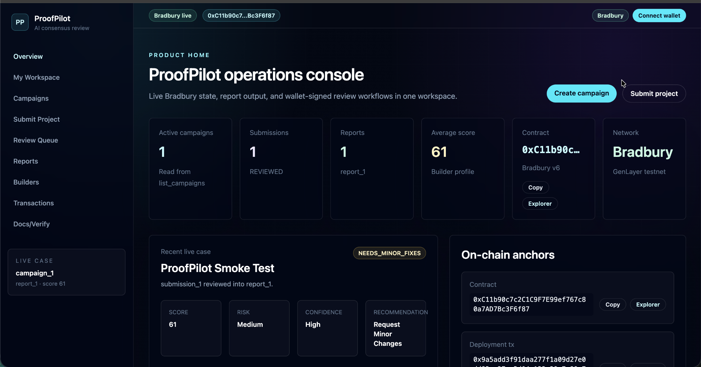
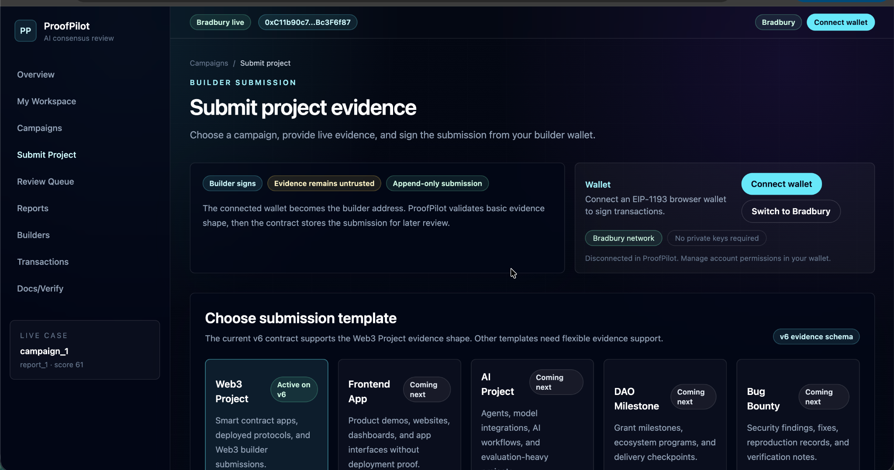
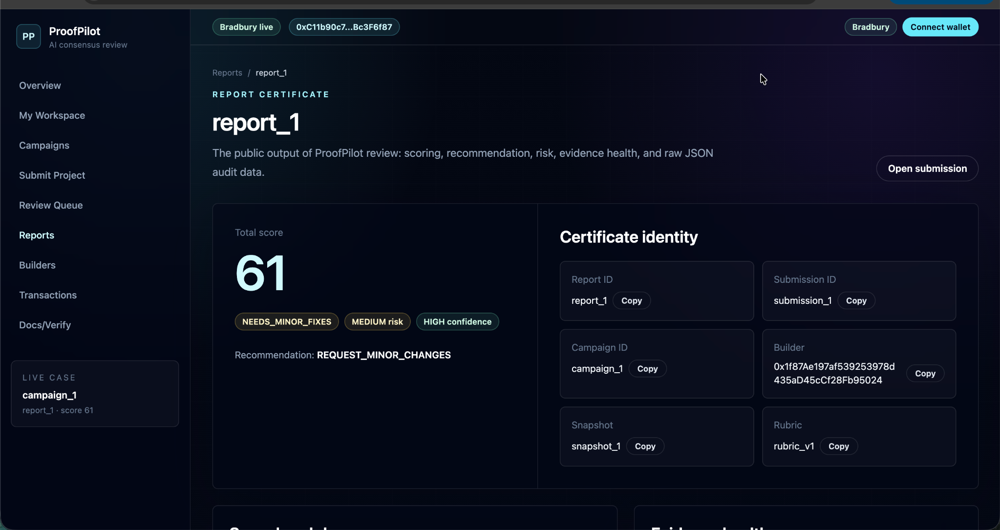
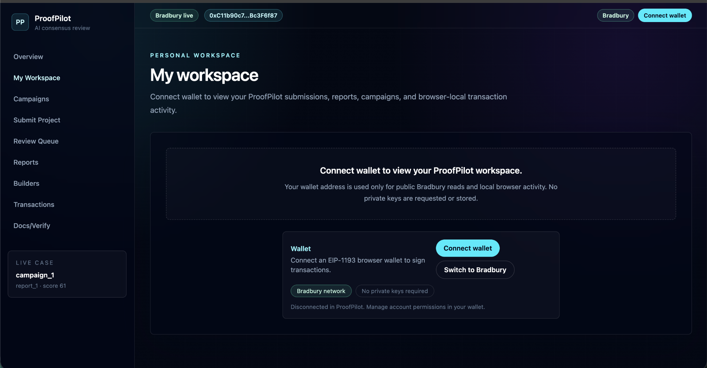
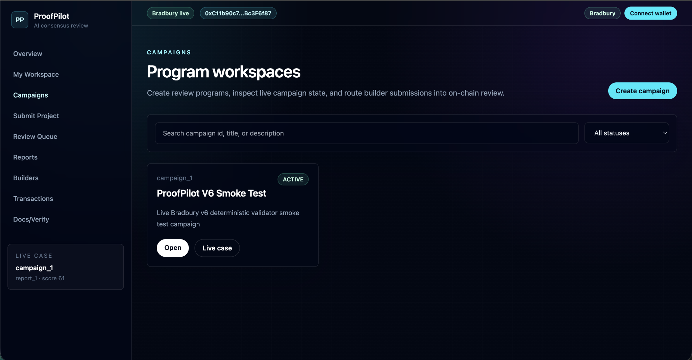

# ProofPilot

AI consensus review for the builder economy.

> **Release status — V9 evidence review is finalized on Bradbury:** [contract `0x5E32…8504`](https://explorer-bradbury.genlayer.com/address/0x5E327aC97d3462B8c7B4bb4c3C4BE75b954f8504) was finalized from [deployment `0xa316…073f`](https://explorer-bradbury.genlayer.com/tx/0xa3168dddac8b51aee73a129188ac987eecb123ed8c559b0ac294952452fe073f). Its public fixture (`campaign_1` → `submission_1` → `report_1`) reached `100/100`, `READY_FOR_REVIEW`, `LOW` risk, and `APPROVE_FOR_HUMAN_REVIEW`; its [review transaction `0xfdfb…9be4`](https://explorer-bradbury.genlayer.com/tx/0xfdfb62a1e2c883ab89b8a705282a3c11c3ad1027a8984a0df4ae67605cd59be4) is finalized. This is a recommendation for a human program owner, not an automatic grant or legal decision.
>
> **Governance workflow candidate:** the source in this repository adds report-linked re-check, appeal-resolution, and human-decision records. These methods are **not** present at the historical V9 address. They require a fresh V10 Studio/Bradbury deployment and an end-to-end test before they can be described as live.

ProofPilot uses GenLayer Intelligent Contracts to verify live project evidence, score submissions against transparent rubrics, and publish on-chain review reports for builders, grants, hackathons, and bounty programs.

## What ProofPilot Does

ProofPilot is a GenLayer-native review engine for programs that need credible, repeatable evaluation of builder work. A builder submits evidence for a project, including a live app URL, GitHub repository, documentation, deployed contract address, deployment transaction hash, reviewer feedback, and an explanation of fixes. A GenLayer Intelligent Contract then fetches evidence through GenLayer web access, evaluates the submission against a campaign rubric, and stores a public review report.

The goal is not to replace human program owners. The goal is to give them an auditable AI consensus layer that can check live evidence, apply transparent criteria, explain scoring, and produce consistent recommendations before a final approval, grant release, bounty acceptance, or hackathon judging decision.

**Scope boundary:** ProofPilot verifies public resource reachability and whether submitted explorer responses contain the submitted contract address or transaction identifier. These are separate public checks; they do not prove that a transaction deployed a particular contract, nor do they establish legal identity, ownership, security, originality, or universal quality. Its AI assessment is deliberately bounded by captured facts and the campaign rubric, and a human program owner makes the final decision.

## Target Use Cases

- Grant milestone reviews
- Hackathon submission screening
- Bounty completion verification
- Ecosystem app quality reviews
- Builder reputation and proof-of-work history
- Optional human review workflows backed by AI consensus reports

## MVP-Plus Scope

ProofPilot is designed as a flagship GenLayer application, not a minimal demo. The documented system includes:

- Campaigns with executable, fixed-category 100-point rubrics and eligibility rules
- Builder submissions with structured evidence fields
- Evidence snapshots captured through GenLayer web access
- AI consensus review reports with strict JSON output
- Builder reputation profiles derived from review history
- Report-linked re-check, appeal-resolution, and human-decision flows (V10 candidate; see release status above)

## Core Workflow

1. A program owner creates a campaign with a rubric and review settings.
2. A builder submits project evidence.
3. The contract fetches compact evidence facts using GenLayer web access, currently `gl.nondet.web.get`.
4. The leader fetches compact public facts and requests bounded AI commentary while prompt-injection defenses treat fetched content as untrusted.
5. Validators independently fetch the same compact evidence and derive the canonical score, status, recommendation, risk, and confidence from observable criteria. AI commentary never changes the stored decision.
6. The strict JSON review report is stored publicly and linked to the campaign, submission, and builder profile.
7. Contract and deployment identifiers are fetched from their submitted explorer resources. A category is forced to zero and recorded as unverified when its submitted identifier is not present in the fetched response. The report labels these as independent checks and does not claim deployment linkage.
8. On V10, a builder may request a re-check or open an appeal with bounded public HTTPS evidence.
9. On V10, a campaign owner can resolve that appeal or record a separate final human decision. Both records are retrievable from the linked public report and never overwrite the consensus report.

## Rubric V1

ProofPilot's initial rubric totals 100 points:

| Category | Points |
| --- | ---: |
| Live app availability | 15 |
| GitHub repository availability | 10 |
| README/documentation quality | 15 |
| Contract address consistency | 20 |
| Deployment transaction proof | 15 |
| Reviewer feedback addressed | 15 |
| Professional presentation | 5 |
| Risk, broken links, or mismatch checks | 5 |

Review statuses:

- `READY_FOR_REVIEW`
- `NEEDS_MINOR_FIXES`
- `NEEDS_MAJOR_FIXES`
- `NOT_READY`

Recommendations:

- `APPROVE_FOR_HUMAN_REVIEW`
- `REQUEST_MINOR_CHANGES`
- `REQUEST_MAJOR_CHANGES`
- `REJECT_OR_RESUBMIT`

## GenLayer Design Constraints

ProofPilot documentation assumes these GenLayer-specific constraints:

- Raw URLs must not be placed into LLM prompts with the expectation that validators will browse them.
- Contract web access must use GenLayer web access functions. The current review path uses `gl.nondet.web.get` and does not use `gl.nondet.web.render`.
- The current review path uses `gl.vm.run_nondet_unsafe`. Validators independently fetch source evidence and reproduce the canonical, source-grounded decision; they do not compare naturally variable AI prose or subjective scores.
- Fetched web content must be treated as untrusted evidence.
- Review prompts must defend against prompt injection from fetched webpages, README files, docs, and app pages.
- Review output must be strict JSON.
- Fetch failures must be handled gracefully and scored conservatively.

## Bradbury Release History

Historical deployments remain independently auditable and are not represented as proof of a completed current workflow:

- V8 contract: [`0x35B5…B86e`](https://explorer-bradbury.genlayer.com/address/0x35B51C656609507203093B7D9976F1C856e6B86e), finalized from [`0x5205…6be5`](https://explorer-bradbury.genlayer.com/tx/0x5205519d400e5ba3359ecae4858a0396fc2fd465d4397af05e8956e6d3986be5).
- V8’s fixture generated a valid leader report but ended undetermined during validator agreement. It is not a successful workflow record.
- The finalized replacement deployment is configured in the public dApp and has a completed public fixture. Historical V8 outcomes remain separate evidence.

### Stable machine-readable evidence

`/evidence` is a compact, cacheable plain-text endpoint designed for public verification by an Intelligent Contract. It identifies ProofPilot, GenLayer, and AI consensus, links the human-facing app, source, and README, and states the scope boundary. Builders may submit this endpoint as the live evidence URL while retaining the main app URL in their project summary.

## Product Screenshots

ProofPilot includes a polished public dApp for campaign owners, builders, reviewers, and public auditors.

### Operations Console

### Submit Project Evidence

### AI Consensus Report Certificate

### Connected Wallet Workspace

### Campaign Workspaces

## Public dApp Usage

ProofPilot now includes a public browser dApp for Bradbury:

- `/app`: product workspace overview.
- `/app/campaigns`: list campaigns and open campaign detail pages.
- `/app/campaigns/new`: create a campaign with wallet signing.
- `/app/campaigns/[campaignId]`: inspect a campaign and its submissions/reports after it is created.
- `/app/submit`: submit project evidence as a builder.
- `/app/submissions/[submissionId]`: inspect a stored submission and owner-only review actions when eligible.
- `/app/reports/[reportId]`: inspect a stored review report and evidence snapshot.
- `/app/builders`: inspect builder reputation profiles.
- Legacy routes such as `/dashboard`, `/campaigns`, `/reports`, and `/builders` redirect into the `/app` shell.

Users sign write transactions with an EIP-1193 browser wallet, such as MetaMask-compatible wallets. ProofPilot never asks for private keys, never stores private keys, and does not sign transactions on the backend.

## Submission Templates

The public app includes a professional template picker for builder submissions:

- `Web3 Project`: active. This template maps directly to `submit_project` with live app URL, GitHub repo URL, docs URL, deployed contract address, deployment transaction hash, reviewer feedback, and fixes explanation.
- `Frontend App`: visible as a locked preview. It requires future flexible evidence support because the current contract requires contract address and deployment transaction fields.
- `AI Project`: visible as a locked preview. It requires future flexible evidence support for model/API docs, benchmarks, and evaluation notes.
- `DAO Milestone`: visible as a locked preview. It requires future flexible evidence support for milestone docs, PR links, and deliverables checklists.
- `Bug Bounty`: visible as a locked preview. It requires future flexible evidence support for reproduction steps, fix PRs, and verification notes.

Locked templates do not show a submit button and do not ask users to enter fake Web3 proof fields. V7 accepts Web3 evidence only.

## Wallet UX

ProofPilot uses browser wallet permissions. The app supports a local disconnect action that hides the connected account inside ProofPilot and stops auto-displaying it until the user clicks Connect again. Wallet account permissions are still controlled by the wallet itself.

## Wallet Transaction Flow

For write actions, the app:

1. Validates form input in the browser and again on the server preparation route.
2. Calls `POST /api/tx/prepare` to encode GenLayer consensus calldata for the requested contract method.
3. Sends the prepared calldata to the Bradbury consensus contract through the connected browser wallet.
4. Lets the user approve or reject the transaction in their wallet.
5. Waits for the EVM receipt and attempts to extract the GenLayer transaction ID from consensus logs.
6. Links the EVM transaction and GenLayer transaction to Bradbury Explorer when available.
7. Uses read APIs to verify final contract state. The UI does not claim contract success from wallet submission alone.

Known Bradbury gas behavior:

- `submit_project` defaults to a `5,000,000` gas limit override.
- `run_review` defaults to a `7,000,000` gas limit override.
- Users can adjust gas limits before signing if Bradbury behavior changes.

To verify reports manually, read `get_report("report_1")`, `get_submission("submission_1")`, and `get_evidence_snapshot("snapshot_1")` from the deployed contract or open the report page in the dApp.

## Documentation Map

- [Product Spec](docs/PRODUCT_SPEC.md): product goals, users, workflows, data models, statuses, and launch scope.
- [Architecture](docs/ARCHITECTURE.md): system components, GenLayer contract responsibilities, evidence flow, storage model, and method design.
- [Testing](docs/TESTING.md): test strategy and scope.
- [Governance workflow](docs/GOVERNANCE_WORKFLOW.md): V10 transition rules, permissions, public decision ledger, and deployment test plan.
- [V9 release checklist](docs/V9_RELEASE_CHECKLIST.md): historical V9 deployment and evidence checks.
- [Review Strategy](docs/REVIEW_STRATEGY.md): rubric design, scoring guidance, prompt safety, consensus expectations, and appeal handling.

## Current Repository Status

This repository contains the finalized V9 evidence-review source and fixture, plus a V10 governance-workflow candidate with executable local transition tests. The browser frontend remains configured for the finalized V9 Bradbury address until a V10 contract is deployed, finalized, tested, and explicitly configured.
